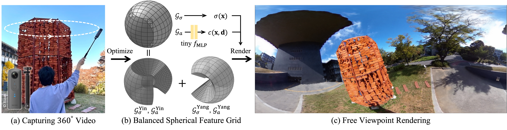

# Balanced Spherical Grid for Egocentric View Synthesis
<div style="text-align:center">

</div>
<br/>
Official implementation of <b>Balanced Spherical Grid for Egocentric View Synthesis (CVPR 2023)</b>

### [Project Page](https://changwoon.info/publications/EgoNeRF) | [Paper](https://arxiv.org/abs/2303.12408) | [Data](https://drive.google.com/drive/folders/1kqLAATjSSDwfLHI5O7RTfM9NOUi7PvcK)

## TL;DR - One Sentence Summary 
EgoNeRF is a grid-based NeRF model that utilize a balanced spherical grid to reconstruct large-scale egocentric captured scenes. 
___


## Installation 
### Environment Setup
We tested our code on Ubuntu 20.04 with RTX 3090 GPU. With proper version of CUDA toolkit, it would work on other environments.
```
conda create -n EgoNeRF python=3.8
conda activate EgoNeRF
pip install torch torchvision --extra-index-url https://download.pytorch.org/whl/cu113
pip install -r requirements.txt
```

### Dataset
We provide OmniBlender and Ricoh360 datset. You can download the dataset from the google drive link above. Put the data in the directory <span style="background-color: #D3D3D3">data/</span>

## Training EgoNeRF
To train EgoNeRF, run the scripts below.
```
python train.py --config configs/omniblender/barbershop/default.txt
```

## Citation
Cite as below if you find this paper and repository are helpful to you:
```
@InProceedings{Choi_2023_CVPR,
    author    = {Choi, Changwoon and Kim, Sang Min and Kim, Young Min},
    title     = {Balanced Spherical Grid for Egocentric View Synthesis},
    booktitle = {Proceedings of the IEEE/CVF Conference on Computer Vision and Pattern Recognition (CVPR)},
    month     = {June},
    year      = {2023},
    pages     = {16590-16599}
}
```